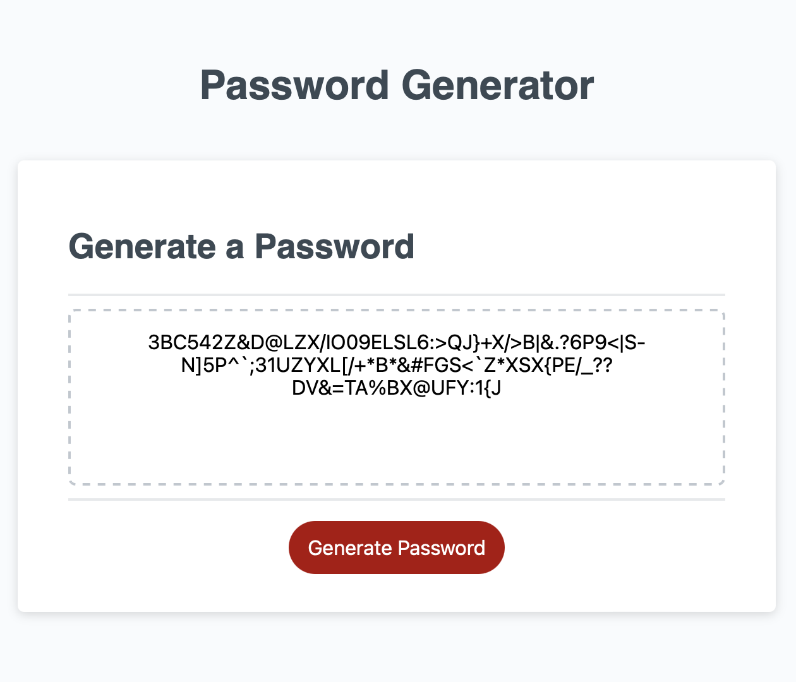

<div align="center">

<a href="https://github.com/emsim11/Password-Generator"></a>

# Password Generator

<h3>An application to generate a random password based on your specifications!</h3>

[](https://choosealicense.com/licenses/mit/) [](https://github.com/emsim11) [](mailto:emsimone11@gmail.com) [](ENTERHERE)

<p>
<a href="#description">Description</a> • 
<a href="#usage">Usage</a> • 
<a href="#support">Support</a> • 
<a href="#credits">Credits</a> • 
<a href="#license">License</a> </p>

</div>

## Description

This web application uses JavaScript to allow users to generate a random password. Random passwords can be helpful, as they are harder to hack! You should not include personal data in your passwords, so this random password generator solves the real-world issue of creating passwords that make it difficult to hack. This Challenge allowed me to apply the JavaScript code I learned about in Module 3, including event listeners, for loops, and logging to the console.

[Back to Top](#password-generator)

### User Story

```md
AS AN employee with access to sensitive data

I WANT to randomly generate a password that meets certain criteria

SO THAT I can create a strong password that provides greater security
```

### Acceptance Criteria

```md
GIVEN I need a new, secure password

WHEN I click the button to generate a password

THEN I am presented with a series of prompts for password criteria

WHEN prompted for password criteria

THEN I select which criteria to include in the password

WHEN prompted for the length of the password

THEN I choose a length of at least 8 characters and no more than 128 characters

WHEN asked for character types to include in the password

THEN I confirm whether or not to include lowercase, uppercase, numeric, and/or special characters

WHEN I answer each prompt

THEN my input should be validated and at least one character type should be selected

WHEN all prompts are answered

THEN a password is generated that matches the selected criteria

WHEN the password is generated

THEN the password is either displayed in an alert or written to the page
```

[Back to Top](#password-generator)

## Usage

To use this deployed application, click the "Generate Password" button. The page will instruct you to enter a number to indicate how many characters you wish to include in your password. Note that this value must be a number (no letters or special characters), and that it must be a number between 8 and 128. Otherwise, an alert will show that says "Invalid entry." 

Once you have chosen your password's length and clicked "OK", you will be asked four questions about whether you would like your password to include lowercase, uppercase, numeric, and special characters. To use a specific type of character in your password, click "OK". If you do not wish to include a character type in your password, click "Cancel".

Once you have completed the character-type questions, a password that meets your inputted password criteria will appear on the page! Just copy and paste it into the desired location to use it!

**Note:** You may want to securely store the generated password somewhere for safekeeping and for easy referencing in the future!

[Back to Top](#password-generator)

### Visuals



## Support

If you have any questions, or additional feedback, please feel free to contact me. I will get back to you as soon as possible.

*Contact Information:*

GitHub: [emsim11](https://github.com/emsim11)

Email: emsimone11@gmail.com

*Submit an Issue:*

If you are experiencing an issue with this application, please submit an [issue ticket](https://github.com/emsim11/Password-Generator/issues).

[Back to Top](#password-generator)

## Credits

Here are listed the sources that helped make this project possible.

### Authors

*The following developers helped create this project:*

[Emily Simone](https://github.com/emsim11) - Main Developer

## License

&copy; 2024 Emily Simone

This application is licensed under the [MIT License](./LICENSE).